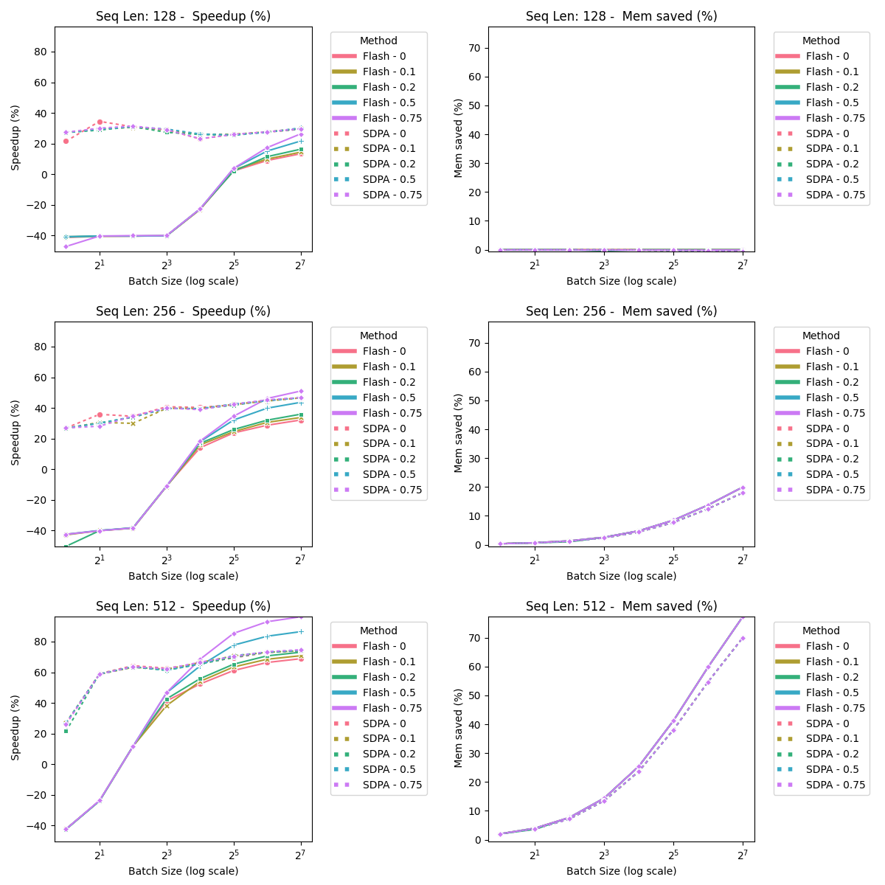
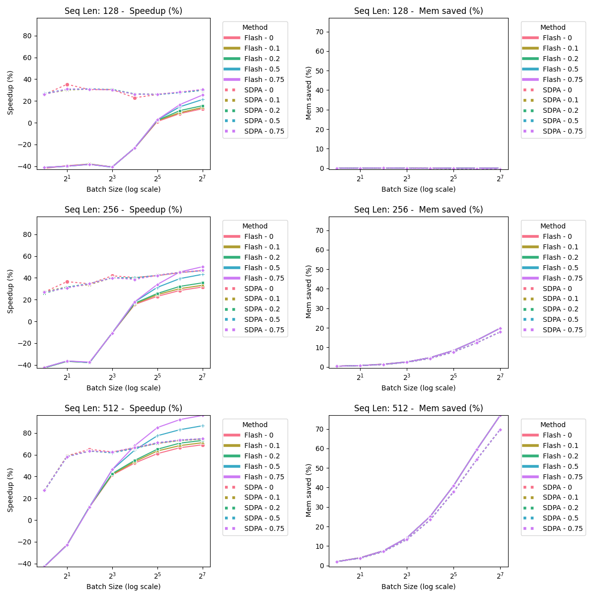
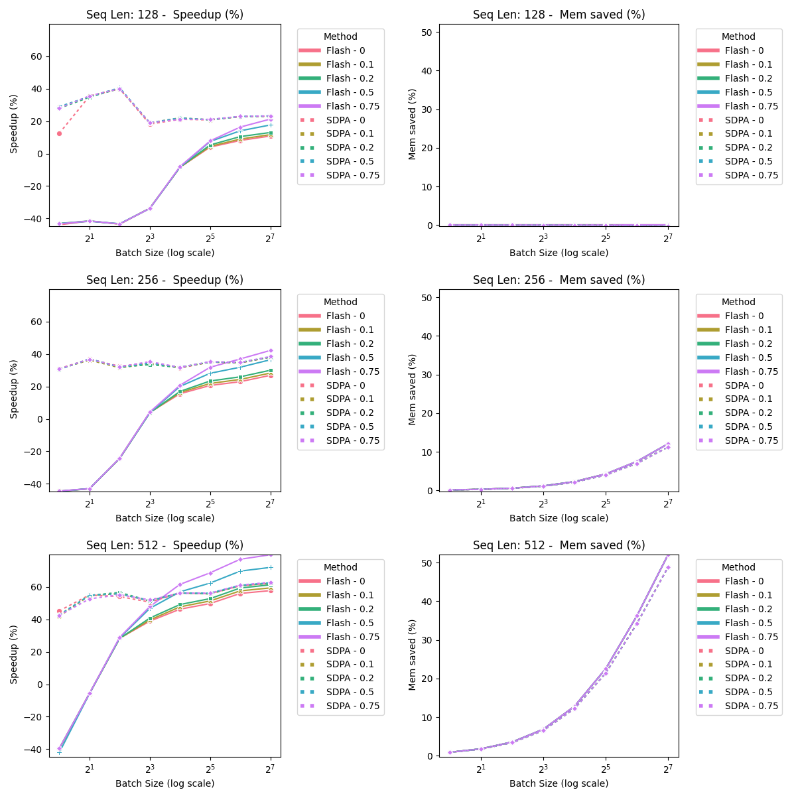

# HPML_Bert_Benchmarking

This repository contains scripts for benchmarking BERT models across different tasks such as masked language modeling (MLM), sequence classification, token classification, and question answering. The scripts utilize the Hugging Face Transformers library (which we added the support for FlashAttention2) to load pre-trained models and perform benchmarks on specified tasks with options for various configurations.

## Code outline

HPML_BERT_BENCHMARKING/
├── classification/                    # Classification task results
│   ├── combined_plot.png              # Combined plot for classification task
│   ├── log_Bert_flash_attention_2_classification.csv  # Benchmark results for classification task using FlashAttention2
│   ├── log_Bert_sdpa_classification.csv              # Benchmark results for classification task using SDPA
│   ├── SeqLen_128_Mem_saved_(%).png   # Memory saved plot for classification task
│   ├── SeqLen_128_Speedup_(%).png     # Speedup plot for classification task
│   ├── SeqLen_256_Mem_saved_(%).png   # Memory saved plot for classification task
│   ├── SeqLen_256_Speedup_(%).png     # Speedup plot for classification task
│   ├── SeqLen_512_Mem_saved_(%).png   # Memory saved plot for classification task
│   └── SeqLen_512_Speedup_(%).png     # Speedup plot for classification task
│
├── mlm/                               # Masked Language Modeling task results
│   ├── combined_plot.png              # Combined plot for MLM task
│   ├── log_Bert_flash_attention_2_mlm.csv            # Benchmark results for MLM task using FlashAttention2
│   ├── log_Bert_sdpa_mlm.csv                         # Benchmark results for MLM task using SDPA
│   ├── SeqLen_128_Mem_saved_(%).png   # Memory saved plot for MLM task
│   ├── SeqLen_128_Speedup_(%).png     # Speedup plot for MLM task
│   ├── SeqLen_256_Mem_saved_(%).png   # Memory saved plot for MLM task
│   ├── SeqLen_256_Speedup_(%).png     # Speedup plot for MLM task
│   ├── SeqLen_512_Mem_saved_(%).png   # Memory saved plot for MLM task
│   └── SeqLen_512_Speedup_(%).png     # Speedup plot for MLM task
│
├── qa/                                # Question Answering task results
│   ├── combined_plot.png              # Combined plot for QA task
│   ├── log_Bert_flash_attention_2_qa.csv             # Benchmark results for QA task using FlashAttention2
│   ├── log_Bert_sdpa_qa.csv                          # Benchmark results for QA task using SDPA
│   ├── SeqLen_128_Mem_saved_(%).png   # Memory saved plot for QA task
│   ├── SeqLen_128_Speedup_(%).png     # Speedup plot for QA task
│   ├── SeqLen_256_Mem_saved_(%).png   # Memory saved plot for QA task
│   ├── SeqLen_256_Speedup_(%).png     # Speedup plot for QA task
│   ├── SeqLen_512_Mem_saved_(%).png   # Memory saved plot for QA task
│   └── SeqLen_512_Speedup_(%).png     # Speedup plot for QA task
│
├── token_classification/              # Token Classification task results
│   ├── combined_plot.png              # Combined plot for token classification task
│   ├── log_Bert_flash_attention_2_token_classification.csv  # Benchmark results for token classification task using FlashAttention2
│   ├── log_Bert_sdpa_token_classification.csv        # Benchmark results for token classification task using SDPA
│   ├── SeqLen_128_Mem_saved_(%).png   # Memory saved plot for token classification task
│   ├── SeqLen_128_Speedup_(%).png     # Speedup plot for token classification task
│   ├── SeqLen_256_Mem_saved_(%).png   # Memory saved plot for token classification task
│   ├── SeqLen_256_Speedup_(%).png     # Speedup plot for token classification task
│   ├── SeqLen_512_Mem_saved_(%).png   # Memory saved plot for token classification task
│   └── SeqLen_512_Speedup_(%).png     # Speedup plot for token classification task
│
├── results/                           # Benchmark results
│   ├── log_Bert_flash_attention_2_classification.csv  # Benchmark results for classification task using FlashAttention2
│   ├── log_Bert_flash_attention_2_mlm.csv            # Benchmark results for MLM task using FlashAttention2
│   ├── log_Bert_flash_attention_2_qa.csv             # Benchmark results for QA task using FlashAttention2
│   ├── log_Bert_flash_attention_2_token_classification.csv  # Benchmark results for token classification task using FlashAttention2
│   ├── log_Bert_sdpa_classification.csv              # Benchmark results for classification task using SDPA
│   ├── log_Bert_sdpa_mlm.csv                        # Benchmark results for MLM task using SDPA
│   ├── log_Bert_sdpa_qa.csv                         # Benchmark results for QA task using SDPA
│   └── log_Bert_sdpa_token_classification.csv        # Benchmark results for token classification task using SDPA
│
├── benchmark_Bert.py                  # Python script for benchmarking BERT models
├── plot.py                            # Python script for plotting benchmark results using csv files in the results directory
├── run_Bert.sh                        # Shell script for running the benchmarking script
├── .gitignore                         # Specifies intentionally untracked files to ignore
├── LICENSE                            # The LICENSE file
└── README.md                          # The top-level README for developers using this project


- HPML_BERT_BENCHMARKING/
  - classification/
    - combined_plot.png                          # Combined plot for classification task
    - log_Bert_flash_attention_2_classification.csv  # Benchmark results using FlashAttention2
    - log_Bert_sdpa_classification.csv           # Benchmark results using SDPA
    - SeqLen_128_Mem_saved_(%).png               # Memory saved plot for SeqLen 128
    - SeqLen_128_Speedup_(%).png                 # Speedup plot for SeqLen 128
    - SeqLen_256_Mem_saved_(%).png               # Memory saved plot for SeqLen 256
    - SeqLen_256_Speedup_(%).png                 # Speedup plot for SeqLen 256
    - SeqLen_512_Mem_saved_(%).png               # Memory saved plot for SeqLen 512
    - SeqLen_512_Speedup_(%).png                 # Speedup plot for SeqLen 512
  - mlm/
    - combined_plot.png                          # Combined plot for MLM task
    - log_Bert_flash_attention_2_mlm.csv         # Benchmark results using FlashAttention2
    - log_Bert_sdpa_mlm.csv                      # Benchmark results using SDPA
    - SeqLen_128_Mem_saved_(%).png               # Memory saved plot for SeqLen 128
    - SeqLen_128_Speedup_(%).png                 # Speedup plot for SeqLen 128
    - SeqLen_256_Mem_saved_(%).png               # Memory saved plot for SeqLen 256
    - SeqLen_256_Speedup_(%).png                 # Speedup plot for SeqLen 256
    - SeqLen_512_Mem_saved_(%).png               # Memory saved plot for SeqLen 512
    - SeqLen_512_Speedup_(%).png                 # Speedup plot for SeqLen 512
  - qa/
    - combined_plot.png                          # Combined plot for QA task
    - log_Bert_flash_attention_2_qa.csv          # Benchmark results using FlashAttention2
    - log_Bert_sdpa_qa.csv                       # Benchmark results using SDPA
    - SeqLen_128_Mem_saved_(%).png               # Memory saved plot for SeqLen 128
    - SeqLen_128_Speedup_(%).png                 # Speedup plot for SeqLen 128
    - SeqLen_256_Mem_saved_(%).png               # Memory saved plot for SeqLen 256
    - SeqLen_256_Speedup_(%).png                 # Speedup plot for SeqLen 256
    - SeqLen_512_Mem_saved_(%).png               # Memory saved plot for SeqLen 512
    - SeqLen_512_Speedup_(%).png                 # Speedup plot for SeqLen 512
  - token_classification/
    - combined_plot.png                          # Combined plot for token classification task
    - log_Bert_flash_attention_2_token_classification.csv  # Benchmark results using FlashAttention2
    - log_Bert_sdpa_token_classification.csv    # Benchmark results using SDPA
    - SeqLen_128_Mem_saved_(%).png              # Memory saved plot for SeqLen 128
    - SeqLen_128_Speedup_(%).png                # Speedup plot for SeqLen 128
    - SeqLen_256_Mem_saved_(%).png              # Memory saved plot for SeqLen 256
    - SeqLen_256_Speedup_(%).png                # Speedup plot for SeqLen 256
    - SeqLen_512_Mem_saved_(%).png              # Memory saved plot for SeqLen 512
    - SeqLen_512_Speedup_(%).png                # Speedup plot for SeqLen 512
  - results/
    - log_Bert_flash_attention_2_classification.csv  # Classification task results using FlashAttention2
    - log_Bert_flash_attention_2_mlm.csv        # MLM task results using FlashAttention2
    - log_Bert_flash_attention_2_qa.csv         # QA task results using FlashAttention2
    - log_Bert_flash_attention_2_token_classification.csv  # Token classification task results using FlashAttention2
    - log_Bert_sdpa_classification.csv          # Classification task results using SDPA
    - log_Bert_sdpa_mlm.csv                     # MLM task results using SDPA
    - log_Bert_sdpa_qa.csv                      # QA task results using SDPA
    - log_Bert_sdpa_token_classification.csv    # Token classification task results using SDPA
  - benchmark_Bert.py                           # Script for benchmarking BERT models
  - plot.py                                     # Script for plotting benchmark results
  - run_Bert.sh                                 # Shell script for running the benchmark script
  - .gitignore                                  # Specifies intentionally untracked files
  - LICENSE                                     # The LICENSE file
  - README.md                                   # Top-level README for developers


## Installation

Follow these steps to set up the environment and install the required packages:

1. **Clone the Custom Transformers Repository**
   ```bash
   git clone https://github.com/DELTA-DoubleWise/transformers.git
   ```

2. **Set Up a Virtual Environment** (optional but recommended)
   Navigate to the benchmarking directory where you want to run benchmarks and create a virtual environment:

3. **Install the Custom Transformers Library**
   Change to the cloned `transformers` directory and install the library in editable mode:
   ```bash
   cd transformers
   pip install -e .
   ```

4. **Install Other Required Packages**
   After installing the custom transformers library, install other required packages:
   ```bash
   pip install torch tqdm numpy pandas seaborn PIL matplotlib
   ```

## Files

- `benchmark_Bert.py`: The main Python script that performs the benchmarking of BERT models.

## Usage

To run the benchmarking script, you can use the command line to specify various parameters that control the benchmark settings.

### Basic Command Structure

```bash
python benchmark.py [options]
```

### Options

- `--num-batches`: Number of batches to process (default: 50).
- `--batch-size`: Number of samples per batch (default: 64).
- `--avg-seqlen`: Average sequence length, with padding accounted for (default: 512).
- `--max-seqlen`: Maximum sequence length for padding (default: 512).
- `--seqlen-stdev`: Standard deviation for sequence length variation (default: 10).
- `--use-cuda`: Use CUDA for running the model. Recommended if available (default: True).
- `--use-half`: Use half precision (float16) instead of float32 (default: True).
- `--use-mask`: Use an attention mask for the inputs (default: True).
- `--sweep`: Run a sweep through multiple batch sizes and sequence lengths (default: False).
- `--max_token`: For generation tasks, the maximum new tokens to generate (default: 100).
- `--task`: Type of task to benchmark ('mlm', 'classification', 'token_classification', 'qa') (default: 'mlm').
- `--optimization`: Type of optimization to use ('flash_attention_2', 'sdpa') (default: 'flash_attention_2').

### Examples

1. **Running a Specific Task with Specific Settings**
   ```bash
   python benchmark.py --optimization spda --task classification --use-cuda --use-half --batch-size 64 --max-seqlen 512 --num-batches 10
   ```

2. **Running with Sweep**
   To run a benchmark that sweeps through different batch sizes and sequence lengths:
   ```bash
   python benchmark.py --use-cuda --use-half --num-batches 10 --sweep
   ```

3. **Running Shell Scripy**
   For convenience, you can directly run our default shell script:
   ```bash
   ./run_Bert.sh
   ```

### Output

The script outputs benchmark results including latency, memory usage, and potentially speedup percentages into a CSV file located in the `results` directory. These results are useful for analyzing performance characteristics of different speedup method on BERT model performance.

### Visualization

We also provide a file called `plot.py`, which will plot the results generated by the benchmark script to help better visualize the speedup and the memory saved using flash-attention2 compared with the baseline as well as the memory-efficient attention implemented by the official Pytorch team reference to [a version implemented by Meta](https://github.com/facebookresearch/xformers).

To run it, simply execute:
```bash
python plot.py
```

#### Visualization Results
##### Question Answering

##### Token Classification

##### Classification

##### Masked Language Modeling



## Notes

- Ensure you have Ampere, Ada, or Hopper GPUs (e.g., A100, RTX 3090, RTX 4090, H100). FlashAttention 2 currently only support these GPUs.
- Ensure your CUDA devices are properly configured if using GPU acceleration.
---
