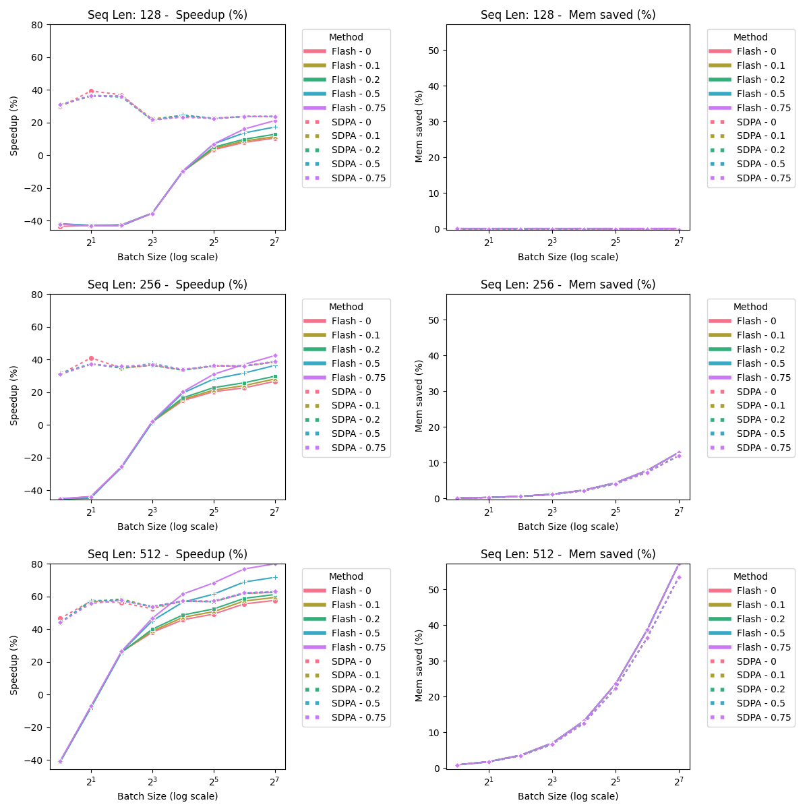

# HPML_Bert_Benchmarking

This repository contains scripts for benchmarking BERT models across different tasks such as masked language modeling (MLM), sequence classification, token classification, and question answering. The scripts utilize the Hugging Face Transformers library (which we added the support for FlashAttention2) to load pre-trained models and perform benchmarks on specified tasks with options for various configurations.

## Code outline

    HPML_BERT_BENCHMARKING/
    ├── classification/                    # Classification task results
    │   ├── combined_plot.png              # Combined plot for classification task
    │   ├── log_Bert_flash_attention_2_classification.csv  # Benchmark results for classification task using FlashAttention2
    │   ├── log_Bert_sdpa_classification.csv              # Benchmark results for classification task using SDPA
    │   ├── SeqLen_128_Mem_saved_(%).png   # Memory saved plot for classification task
    │   ├── SeqLen_128_Speedup_(%).png     # Speedup plot for classification task
    │   ├── SeqLen_256_Mem_saved_(%).png   # Memory saved plot for classification task
    │   ├── SeqLen_256_Speedup_(%).png     # Speedup plot for classification task
    │   ├── SeqLen_512_Mem_saved_(%).png   # Memory saved plot for classification task
    │   └── SeqLen_512_Speedup_(%).png     # Speedup plot for classification task
    │
    ├── mlm/                               # Masked Language Modeling task results
    │   ├── combined_plot.png              # Combined plot for MLM task
    │   ├── log_Bert_flash_attention_2_mlm.csv            # Benchmark results for MLM task using FlashAttention2
    │   ├── log_Bert_sdpa_mlm.csv                         # Benchmark results for MLM task using SDPA
    │   ├── SeqLen_128_Mem_saved_(%).png   # Memory saved plot for MLM task
    │   ├── SeqLen_128_Speedup_(%).png     # Speedup plot for MLM task
    │   ├── SeqLen_256_Mem_saved_(%).png   # Memory saved plot for MLM task
    │   ├── SeqLen_256_Speedup_(%).png     # Speedup plot for MLM task
    │   ├── SeqLen_512_Mem_saved_(%).png   # Memory saved plot for MLM task
    │   └── SeqLen_512_Speedup_(%).png     # Speedup plot for MLM task
    │
    ├── qa/                                # Question Answering task results
    │   ├── combined_plot.png              # Combined plot for QA task
    │   ├── log_Bert_flash_attention_2_qa.csv             # Benchmark results for QA task using FlashAttention2
    │   ├── log_Bert_sdpa_qa.csv                          # Benchmark results for QA task using SDPA
    │   ├── SeqLen_128_Mem_saved_(%).png   # Memory saved plot for QA task
    │   ├── SeqLen_128_Speedup_(%).png     # Speedup plot for QA task
    │   ├── SeqLen_256_Mem_saved_(%).png   # Memory saved plot for QA task
    │   ├── SeqLen_256_Speedup_(%).png     # Speedup plot for QA task
    │   ├── SeqLen_512_Mem_saved_(%).png   # Memory saved plot for QA task
    │   └── SeqLen_512_Speedup_(%).png     # Speedup plot for QA task
    │
    ├── token_classification/              # Token Classification task results
    │   ├── combined_plot.png              # Combined plot for token classification task
    │   ├── log_Bert_flash_attention_2_token_classification.csv  # Benchmark results for token classification task using FlashAttention2
    │   ├── log_Bert_sdpa_token_classification.csv        # Benchmark results for token classification task using SDPA
    │   ├── SeqLen_128_Mem_saved_(%).png   # Memory saved plot for token classification task
    │   ├── SeqLen_128_Speedup_(%).png     # Speedup plot for token classification task
    │   ├── SeqLen_256_Mem_saved_(%).png   # Memory saved plot for token classification task
    │   ├── SeqLen_256_Speedup_(%).png     # Speedup plot for token classification task
    │   ├── SeqLen_512_Mem_saved_(%).png   # Memory saved plot for token classification task
    │   └── SeqLen_512_Speedup_(%).png     # Speedup plot for token classification task
    │
    ├── results/                           # Benchmark results
    │   ├── log_Bert_flash_attention_2_classification.csv  # Benchmark results for classification task using FlashAttention2
    │   ├── log_Bert_flash_attention_2_mlm.csv            # Benchmark results for MLM task using FlashAttention2
    │   ├── log_Bert_flash_attention_2_qa.csv             # Benchmark results for QA task using FlashAttention2
    │   ├── log_Bert_flash_attention_2_token_classification.csv  # Benchmark results for token classification task using FlashAttention2
    │   ├── log_Bert_sdpa_classification.csv              # Benchmark results for classification task using SDPA
    │   ├── log_Bert_sdpa_mlm.csv                        # Benchmark results for MLM task using SDPA
    │   ├── log_Bert_sdpa_qa.csv                         # Benchmark results for QA task using SDPA
    │   └── log_Bert_sdpa_token_classification.csv        # Benchmark results for token classification task using SDPA
    │
    ├── benchmark_Bert.py                  # Python script for benchmarking BERT models
    ├── plot.py                            # Python script for plotting benchmark results using csv files in the results directory
    ├── run_Bert.sh                        # Shell script for running the benchmarking script
    ├── .gitignore                         # Specifies intentionally untracked files to ignore
    ├── LICENSE                            # The LICENSE file
    └── README.md                          # The top-level README for developers using this project


## Installation

Follow these steps to set up the environment and install the required packages:

1. **Clone the Custom Transformers Repository**
   ```bash
   git clone https://github.com/DELTA-DoubleWise/transformers.git
   ```

2. **Set Up a Virtual Environment** (optional but recommended)
   Navigate to the benchmarking directory where you want to run benchmarks and create a virtual environment:

3. **Install the Custom Transformers Library**
   Change to the cloned `transformers` directory and install the library in editable mode:
   ```bash
   cd transformers
   pip install -e .
   ```

4. **Install Other Required Packages**
   After installing the custom transformers library, install other required packages:
   ```bash
   pip install torch tqdm numpy pandas seaborn PIL matplotlib
   ```

## Files

- `benchmark_Bert.py`: The main Python script that performs the benchmarking of BERT models.

## Usage

To run the benchmarking script, you can use the command line to specify various parameters that control the benchmark settings.

### Basic Command Structure

```bash
python benchmark.py [options]
```

### Options

- `--num-batches`: Number of batches to process (default: 50).
- `--batch-size`: Number of samples per batch (default: 64).
- `--avg-seqlen`: Average sequence length, with padding accounted for (default: 512).
- `--max-seqlen`: Maximum sequence length for padding (default: 512).
- `--seqlen-stdev`: Standard deviation for sequence length variation (default: 10).
- `--use-cuda`: Use CUDA for running the model. Recommended if available (default: True).
- `--use-half`: Use half precision (float16) instead of float32 (default: True).
- `--use-mask`: Use an attention mask for the inputs (default: True).
- `--sweep`: Run a sweep through multiple batch sizes and sequence lengths (default: False).
- `--max_token`: For generation tasks, the maximum new tokens to generate (default: 100).
- `--task`: Type of task to benchmark ('mlm', 'classification', 'token_classification', 'qa') (default: 'mlm').
- `--optimization`: Type of optimization to use ('flash_attention_2', 'sdpa') (default: 'flash_attention_2').

### Examples

1. **Running a Specific Task with Specific Settings**
   ```bash
   python benchmark.py --optimization spda --task classification --use-cuda --use-half --batch-size 64 --max-seqlen 512 --num-batches 10
   ```

2. **Running with Sweep**
   To run a benchmark that sweeps through different batch sizes and sequence lengths:
   ```bash
   python benchmark.py --use-cuda --use-half --num-batches 10 --sweep
   ```

3. **Running Shell Scripy**
   For convenience, you can directly run our default shell script:
   ```bash
   ./run_Bert.sh
   ```

### Output

The script outputs benchmark results including latency, memory usage, and potentially speedup percentages into a CSV file located in the `results` directory. These results are useful for analyzing performance characteristics of different speedup method on BERT model performance.

### Visualization

We also provide a file called `plot.py`, which will plot the results generated by the benchmark script to help better visualize the speedup and the memory saved using flash-attention2 compared with the baseline as well as the memory-efficient attention implemented by the official Pytorch team reference to [a version implemented by Meta](https://github.com/facebookresearch/xformers).

To run it, simply execute:
```bash
python plot.py
```

#### Visualization Results
##### Question Answering

##### Token Classification

##### Classification

##### Masked Language Modeling


## Observation
- For all four tasks, the trend of the results presents a similar pattern. In this section, we will use the result for the task of masked language modeling (mlm) to interpret the result. For other tasks, we put the plot in the appendix.
- Impacts of Batch Size
  - Through our experiments, we observed that batch size significantly influences the efficiency gains in inference time and memory usage when using Flash Attention 2. Specifically, as the batch size increases, the speedup in inference time becomes more pronounced. For instance, with a sequence length of 512—a common configuration for the BERT model—the inference time with a batch size of 1 is longer than that of the standard attention method. However, as the batch size expands, we notice a considerable improvement in performance. As shown in the figure, there is a 30\% speedup at a batch size of 4, and this enhancement grows to between 50\% and 80\% with varying padding percentages as the batch size continues to increase. Similarly, memory savings also escalate with larger batch sizes, especially evident when the sequence lengths are 256 and 512. In these scenarios, we observe a monotonically increasing relationship between batch size and memory saved.
  - We suspect that this trend can be attributed to the way Flash Attention 2 optimizes memory access and computational efficiency. In smaller batch sizes, the overhead of initializing and synchronizing the computational resources might dominate, diminishing the relative gains from the optimized attention mechanism. As the batch size grows, these overheads are amortized over a larger number of computations, making the efficient computation and memory access patterns of Flash Attention 2 more impactful.
- Impacts of Maximum Sequence Length
  - We also observe that maximum sequence length significantly influences the model's performance, affecting both the speed of inference and memory utilization. Our findings indicate a clear trend: holding batch size and padding percentage constant, an increase in maximum sequence length consistently results in greater inference speedup and memory savings. For example, with a batch size of 128 and a padding percentage of 50\%, the inference speedup for maximum sequence lengths of 128, 256, and 512 is 17.7\%, 36.5\%, and 72.1\%, respectively. Correspondingly, we can see memory savings are 0\%, 12.1\%, and 52.0\%. This trend is intuitive as longer sequence lengths allow Flash Attention 2 to more effectively leverage its optimized memory access patterns and computational strategies. Longer sequences generally involve more data processing, which benefits disproportionately from the optimized handling of memory and attention mechanisms. As sequences extend, the relative overhead of initiating and managing computations decreases, allowing the underlying efficiencies of Flash Attention 2 to manifest more prominently.
- Impacts of Padding Percentage
  - We observed that while padding percentage does not significantly affect memory savings, it does influence inference speedup to some extent. Specifically, with smaller batch sizes, variations in padding percentage do not markedly alter the speedup of inference times. However, as the batch size increases—exceeding 8 with a maximum sequence length of 512, for example—the presence of more padding tokens in the input sequences correlates with better inference speedup. Typically, processing a high percentage of padding tokens involves expending computational resources on non-informative parts of the data, which would ostensibly reduce efficiency. Yet, our results indicate that Flash Attention 2 effectively manages scenarios with high padding percentages, optimizing the processing time by not focusing on these non-contributive elements, thereby enhancing overall inference performance.
- Comparison Between Our Flash-Attention and the SDPA Memory-Efficient Attention
  - Our implementation achieves memory savings comparable to those observed with Pytorch's memory-efficient attention mechanism. However, the speedup dynamics differ significantly. The Pytorch implementation consistently demonstrates a steady speedup across various batch sizes, as shown in figures. In contrast, our implementation only exhibits acceleration when the batch size exceeds 8. This discrepancy may indicate an inherent limitation within our approach, which involves adapting the Huggingface framework. Specifically, we replaced the traditional attention computation with the FlashAttention2 mechanism, but this integration may have introduced redundant steps that impact performance at smaller batch sizes. Further optimization or a more tailored integration might be necessary to enhance efficiency across all conditions. However, our findings reveal that as the batch size increases, our implementation achieves a speedup comparable to that of the memory-efficient attention mechanism. This convergence in performance becomes particularly pronounced with larger batch sizes. Notably, when the maximum sequence length is set to 512 and the batch size exceeds 32, as illustrated in the figure, our implementation outperforms the memory-efficient attention in terms of speedup. This enhanced performance highlights the advantages of the FlashAttention2 mechanism when dealing with longer sequences. The improved efficiency in these scenarios suggests that FlashAttention2 may be particularly well-suited for applications requiring the processing of extensive data sequences, potentially offering significant computational benefits over traditional methods.


## Notes

- Ensure you have Ampere, Ada, or Hopper GPUs (e.g., A100, RTX 3090, RTX 4090, H100). FlashAttention 2 currently only support these GPUs.
- Ensure your CUDA devices are properly configured if using GPU acceleration.
---
